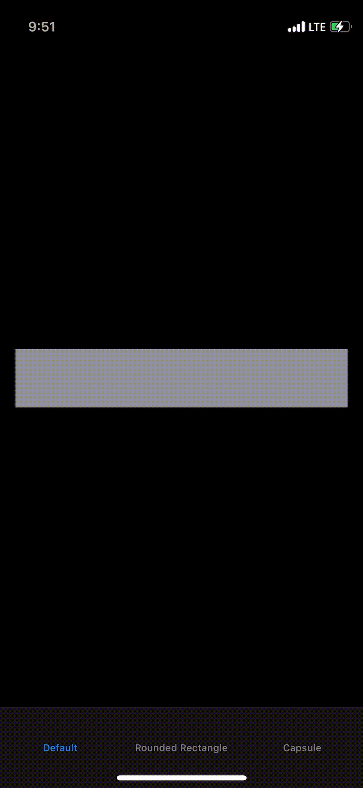
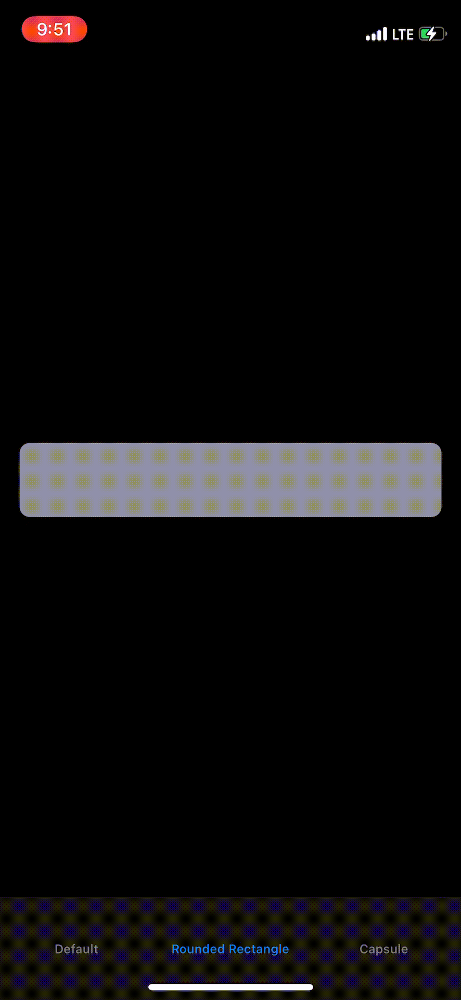
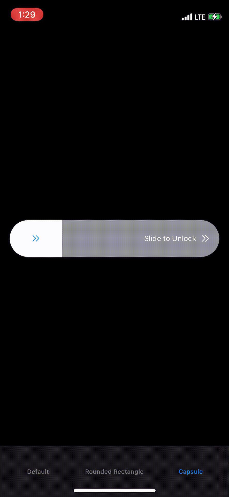

[](https://developer.apple.com/swift)


[](https://github.com/aaronLab/SweetCardScanner/blob/main/LICENSE)
[](https://github.com/aaronLab/SweetCardScanner/releases)

# Unlocker

Unlocker is a simple slider library for [SwiftUI](https://developer.apple.com/xcode/swiftui/), which can look like `Slide to Unlock`. You can use this library for the payment as well as wherever you want easily.

<center>

&nbsp;
&nbsp;

&nbsp;
&nbsp;

</center>

## Requirements

- iOS 13.0 + (due to SwiftUI)

## Installation

- In Xcode, add the URL of this repository in SwiftPM:

```http
https://github.com/aaronLab/Unlocker
```

## Usage

- Import `Unlocker` on top of the file.
- Put `Unlocker` with its parameters into the parenthesis.
- Declare:
  ```Swift
  Unlocker(disabled: Binding<Bool>, percentage: Binding<Float>, minPercentage: Float = 25.0, threshold: Float = 50.0, foregroundColor: Color = .primary, completion: (() -> Void)? = nil)
  ```

## Parameter

- `disabled: Binding<Bool>`:

  - This is a parameter to prevent the double or multiple actions of the slider after the slider is fully swiped.
  - Since the slider will be "disabled" after fully swiped, you will need to toggle "disabled" parameter at the end of your process to make the slider activated again.
  - Or if you don't want to make it back, just leave it there.
  - Or if you don't want to make it disabled ever, just use `.constant(false)`

- `percentage: Binding<Float>`:

  - This is the percentage of the slider.
  - 1.0 is 1 percent.

- `minPercentage: Float = 25.0`:

  - This is a kind of placeholders for the slider.
  - You can make it a bit filled by using this parameter.
  - 25.0 means 25% of the slider will be filled.

- `threshold: Float = 50.0`:

  - This is the threshold for the action.
  - When the user swipe the slider more than the percentage of this value in the screen, the action closure will be triggered.

- `foregroundColor: Color = .primary,`:

  - This is the foreground color of the slider

- `completion: (() -> Void)? = nil`:
  - This closure action will be triggered by the slider.

## Example

```Swift
import SwiftUI
import Unlocker

struct CapsuleShape: View {

    @State private var disabled: Bool = false
    @State private var percentage: Float = 0.0

    var body: some View {

        Unlocker(disabled: $disabled, percentage: $percentage, minPercentage: 0.0, threshold: 50.0, foregroundColor: .red) {
            // Your task here
            print("Process Started")

            /*
             Since the slider will be "disabled" after fully swiped,
             you will need to toggle "disabled" parameter at the end of your process,
             so that you will be able to make the slider activated again.
             Or if you don't want to make it back,
             just leave it there.
             Or if you don't want to make it disabled ever,
             just use `.constant(false)`
             */
            DispatchQueue.main.asyncAfter(deadline: .now() + 3) {
                print("Process Done")
                disabled.toggle()
            }

        }
        .background(Color.gray)
        /*
         You can smiply make the slider RoundedRectangle
         with `.clipShape(Capsule())`
         */
        .clipShape(Capsule())
        .frame(height: 60)
        .padding()
    }
}
```

## More Examples

- See example files [here](https://github.com/aaronLab/Unlocker/tree/master/Examples/Examples)

## License

Licensed under [MIT](https://github.com/aaronLab/Unlocker/blob/master/LICENSE) license.
